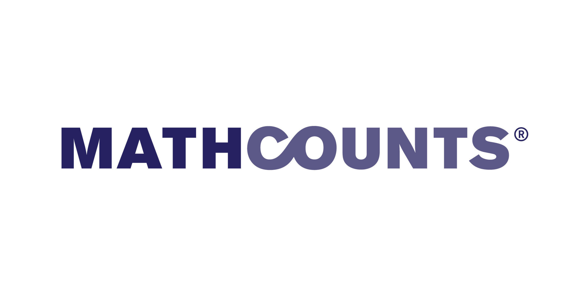

# {{ title }}

SIMC MATHCOUNTS is an annual mock MATHCOUNTS competition for elementary and middle school students, with sprint, target, team, and countdown rounds.

Recent editions were held in March 2025 and March 2026.

Past SIMC MATHCOUNTS editions and materials are available in the past-test cards below.
