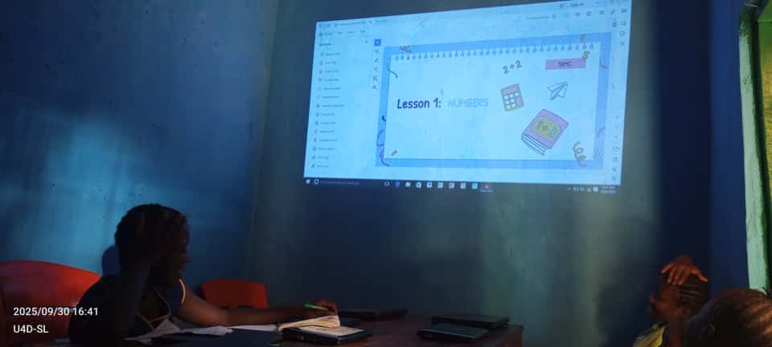
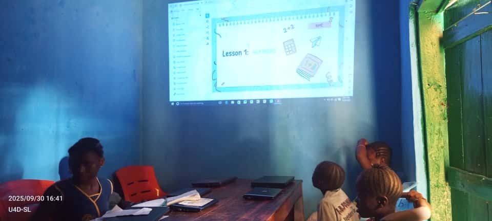
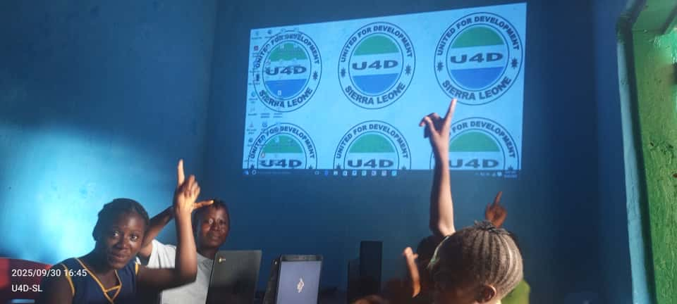
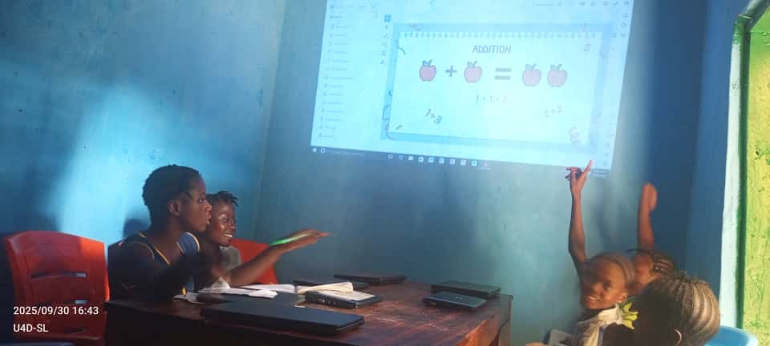
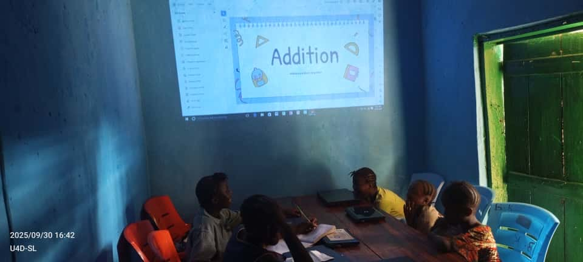

Here at SIMC, we understand how much of a privilege it is to have access to math education. That's why we have been partnering with the all-girls United for Development School in Sierra Leone, providing them with funding, resources, and live instruction to share the joy of math!

